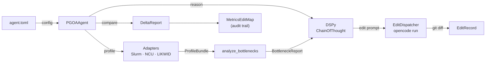

# HPC Claw

> Full architecture and component reference: [docs/architecture.md](docs/architecture.md)

HPC Claw is a cluster-side HPC AI optimization harness.  It drives a closed feedback loop over HPC workloads: profile → classify bottleneck → reason with DSPy → edit code or Slurm script via OpenCode → measure delta → iterate until convergence.

### What it does

- **Cluster discovery** — Slurm topology, hardware, and software environment from the login node; hardware details via optional probe jobs
- **PGOA optimization loop** — `PGOAAgent` orchestrates profiling, bottleneck analysis, and iterative optimization using an OpenAI function-calling loop
- **Structured reasoning** — DSPy `ChainOfThought` signatures convert bottleneck reports into testable hypotheses, OpenCode edit instructions, and post-edit verdicts
- **Code editing** — spawns `opencode run <prompt>` for source-level changes; captures git diff for a full audit trail
- **Edit tracking** — every code edit is linked to its before/after KPI delta in a `MetricsEditMap` persisted to `~/.hpcassist`
- **Path access control** — `readonly_paths` and `data_paths` globs enforced at every filesystem write; driven from `agent.toml`



## Commands

After installing, these commands are the primary operator entry points:

```bash
hclaw assist --repo <path>
hclaw doctor
hclaw discover-cluster
hclaw discover-env
hclaw probe-cluster --partition <name> --yes
```

OpenCode tool bridge:

```bash
hclaw show-opencode-tools
hclaw sync-opencode-tools
```

Textual TUI:

```bash
hclaw-tui [--store ~/.hpcassist] [--env-file .env]
```

## Install

```bash
git clone https://github.com/varunsv97/hpc-claw.git
cd hpc-claw
python3 -m venv .venv
. .venv/bin/activate
python -m pip install --upgrade pip
python -m pip install -e src
```

Environment example:

```bash
cp .env.example .env
```

Edit `.env` to set at least:

- `HPC_ASSISTANT_FILESYSTEM_ROOTS`
- `HPC_ASSISTANT_PGOA_STORE_PATH` (defaults to `~/.hpcassist`)
- `HPC_ASSISTANT_OPENAI_API_KEY` if you want to exercise model-backed features

## Test Run On A Cluster

Start with the read-only checks:

```bash
hclaw assist --repo .
hclaw doctor
hclaw discover-cluster
hclaw discover-env
```

If those look correct and you explicitly want compute-node topology:

```bash
hclaw probe-cluster --partition <partition> --yes
```

Launch the TUI:

```bash
hclaw-tui
```

TUI hotkeys:

| Key | Screen | Description |
|-----|--------|-------------|
| `1` | Dashboard | Store stats and recent activity |
| `2` | Workloads | Runs table with bottleneck detail |
| `3` | Edit Audit | Edit trail + inline diff viewer |
| `4` | Cluster | Cluster profile viewer |
| `5` | Settings | Active env vars |
| `6` | Jobs | Live Slurm queue (`squeue`) with `scontrol` detail |
| `7` | Explorer | Repo directory tree + file viewer |
| `8` | Chat | Conversational interface with the configured LLM |
| `9` | Hardware/Env | Full CPU/GPU topology + software modules |
| `r` | — | Refresh current screen |
| `q` | — | Quit |

## Guardrails

The prototype is conservative by default:

- filesystem writes are limited to configured roots
- cluster probe jobs are disabled unless explicitly enabled
- OpenCode remains an add-on tool surface, not the core orchestration layer
- repo inspection, editing, and command execution should remain in OpenCode's native flow
- Slurm submission and cancellation should stay behind backend approvals
- Slurm job submission (`sbatch`) via the PGOA loop requires `allow_cluster_probe_jobs=true`
  or it is blocked by `guardrails.py`

## Verification

```bash
# from repo root
source .venv/bin/activate
python -m pytest src/tests/ -q        # → 144 passed
python -c "from claw_backend.pgoa.agent.loop import PGOAAgent; print('ok')"
hclaw doctor
```
