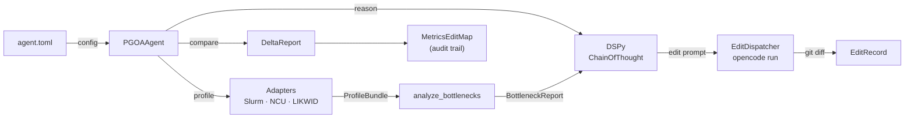

# HPC Claw

> Full architecture and component reference: [docs/architecture.md](docs/architecture.md)

HPC Claw is a cluster-side HPC AI optimization harness.  It drives a closed feedback loop over HPC workloads: profile → classify bottleneck → reason with DSPy → edit code or Slurm script via OpenCode → measure delta → iterate until convergence.

### What it does

- **Cluster discovery** — Slurm topology, hardware, and software environment from the login node; hardware details via optional probe jobs
- **PGOA optimization loop** — `PGOAAgent` orchestrates profiling, bottleneck analysis, and iterative optimization using an OpenAI function-calling loop
- **Structured reasoning** — DSPy `ChainOfThought` signatures convert bottleneck reports into testable hypotheses, OpenCode edit instructions, and post-edit verdicts
- **Code editing** — spawns `opencode run <prompt>` for source-level changes; captures git diff for a full audit trail
- **Edit tracking** — every code edit is linked to its before/after KPI delta in a `MetricsEditMap` persisted to `~/.hpcassist`
- **Path access control** — `readonly_paths` and `data_paths` globs enforced at every filesystem write; driven from `agent.toml`



## Prototype Commands

After installing the backend package, these commands are the primary operator
entry points:

- `hpc-assistant-backend assist --repo <path>`
- `hpc-assistant-backend doctor`
- `hpc-assistant-backend discover-cluster`
- `hpc-assistant-backend discover-env`
- `hpc-assistant-backend probe-cluster --partition <name> --yes`

OpenCode support is still available:

- `hpc-assistant-backend show-opencode-tools`
- `hpc-assistant-backend sync-opencode-tools`

## Install

Python backend:

```bash
python3 -m venv .venv
. .venv/bin/activate
python -m pip install --upgrade pip
python -m pip install -e backend
```

Rust TUI:

```bash
cargo build --manifest-path tui/Cargo.toml
```

Environment example:

```bash
cp .env.example .env
```

Edit `.env` to set at least:

- `HPC_ASSISTANT_FILESYSTEM_ROOTS`
- `HPC_ASSISTANT_PGOA_STORE_PATH` (defaults to `~/.hpcassist`)
- `HPC_ASSISTANT_OPENAI_API_KEY` if you want to exercise model-backed features

## Test Run On A Cluster

Start with the read-only checks:

```bash
hpc-assistant-backend assist --repo .
make prototype-doctor
make prototype-cluster
make prototype-env
```

If those look correct and you explicitly want compute-node topology, run:

```bash
PYTHONPATH=backend/src .venv/bin/python -m hpc_assistant_backend probe-cluster --partition <partition> --yes
```

The Rust TUI is a thin wrapper over the same commands:

```bash
make tui-run
```

Hotkeys:

- `1` assist
- `2` doctor
- `3` cluster
- `4` environment
- `r` refresh current panel
- `q` quit

## Guardrails

The prototype is conservative by default:

- filesystem writes are limited to configured roots
- cluster probe jobs are disabled unless explicitly enabled
- OpenCode remains an add-on tool surface, not the core orchestration layer
- repo inspection, editing, and command execution should remain in OpenCode's native flow
- Slurm submission and cancellation should stay behind backend approvals
- the experimental PGOA loop does not submit or cancel jobs on its own

## Verification

```bash
make test
python3 -m py_compile backend/src/hpc_assistant_backend/*.py
python3 -m py_compile backend/src/hpc_assistant_backend/assistant/*.py
python3 -m py_compile backend/src/hpc_assistant_backend/pgoa/*.py
cargo check --manifest-path tui/Cargo.toml
```
