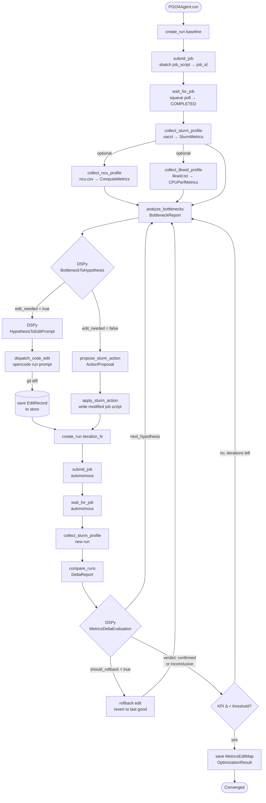
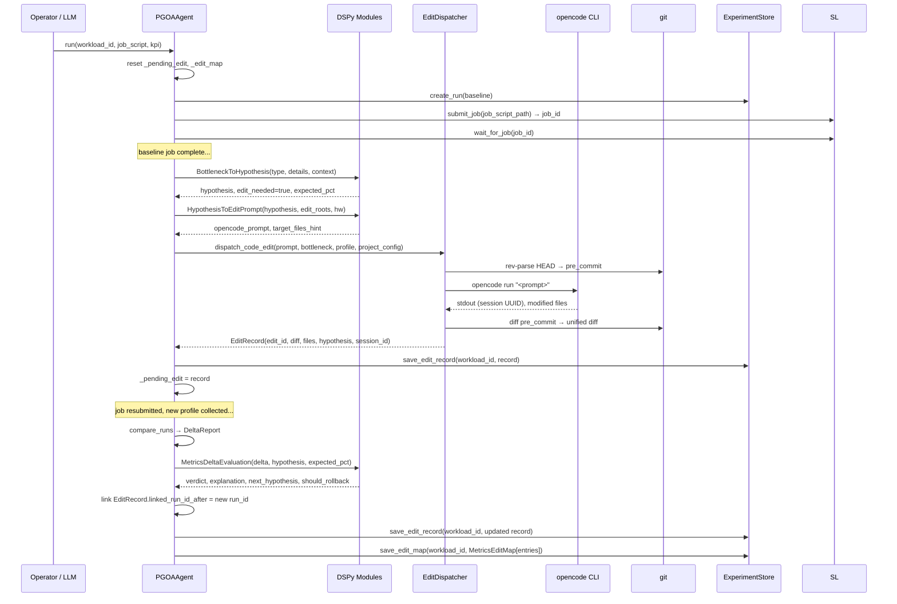
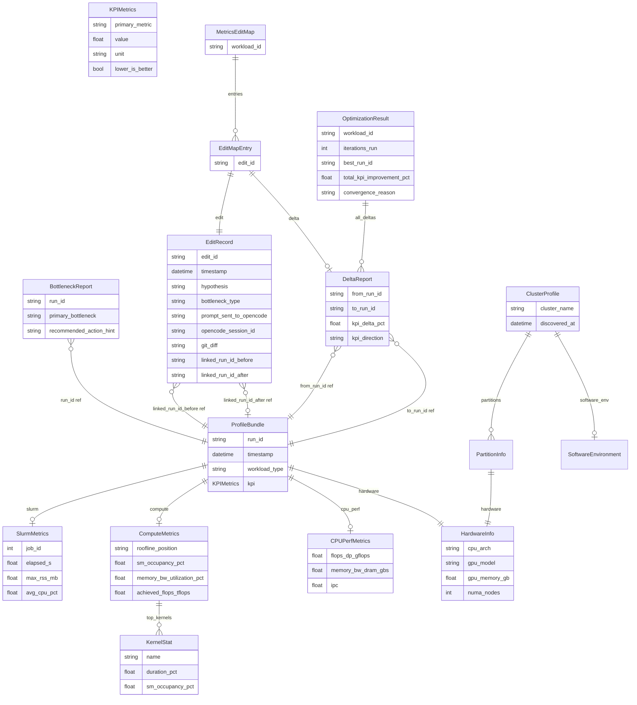
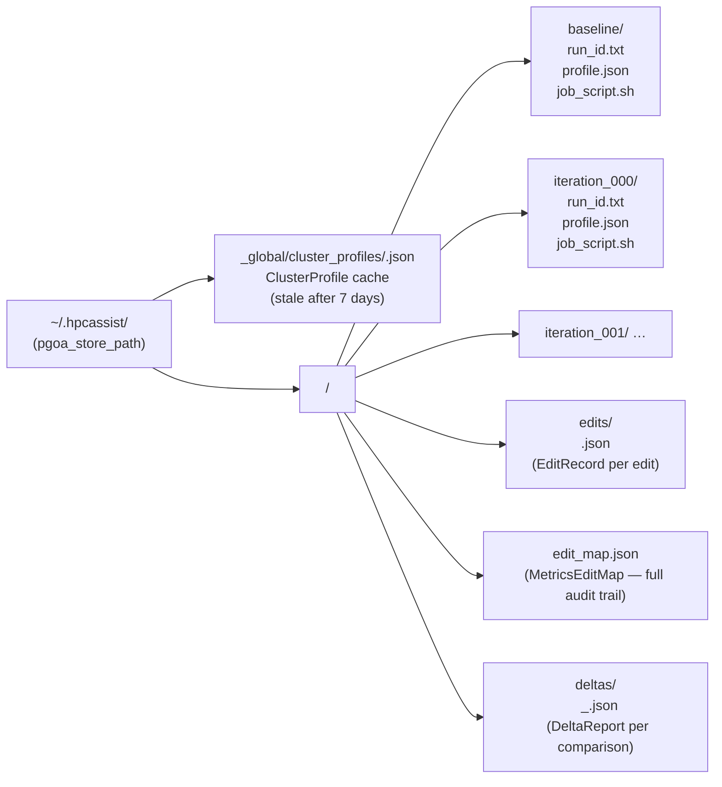
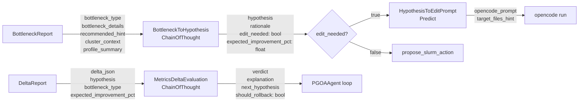

# HPC Claw — Architecture Reference

## Overview

HPC Claw is a cluster-side AI optimization harness that drives a closed feedback loop over HPC workloads:

1. **Profile** a job using real Slurm telemetry, Nsight Compute, or LIKWID.
2. **Analyse** the profile to classify the primary bottleneck.
3. **Reason** with DSPy structured prompts to produce a hypothesis and decide whether a source-code edit or a Slurm-script-only change is needed.
4. **Edit** code via the OpenCode CLI (spawned as a subprocess) or apply a Slurm binding change.
5. **Measure** the delta between before/after runs, evaluate the hypothesis, and either iterate or converge.

The cluster-probe layer also records the module environment, including gated tiers that only appear after loading selector, compiler, or partition modules.

All edits and their resulting metric deltas are stored in a per-workload audit trail (`MetricsEditMap`), giving operators a reproducible record of every change and its measured effect.

---

## System Knowledge Graph

```mermaid
graph TD
    subgraph "Project Config"
        AT["agent.toml"]
        PC["project_config.py\nProjectConfig"]
        AT -->|parsed by| PC
    end

    subgraph "Runtime Config"
        AS["config.py\nAssistantSettings\n(pydantic-settings, HPC_ASSISTANT_* env)"]
    end

    subgraph "OpenCode Surface"
        OT[".opencode/tools/_python.ts\nTypeScript bridge"]
        OC["opencode CLI\nopencode run <prompt>"]
        OT -->|spawns| OC
        OT -->|reads| AT
    end

    subgraph "PGOA Agent"
        AG["pgoa/agent/loop.py\nPGOAAgent"]
        AP["pgoa/agent/prompts.py\nbuild_system_prompt\nbuild_initial_user_message"]
        AT2["pgoa/agent/tools.py\nTOOL_SCHEMAS\n(OpenAI function-call definitions)"]
        AG -->|uses| AP
        AG -->|passes schemas to| LLM["OpenAI API\nchat.completions.create"]
        AT2 --> AG
    end

    subgraph "DSPy Structured Reasoning"
        DP["pgoa/dspy_prompts.py"]
        B2H["BottleneckToHypothesis\nChainOfThought"]
        H2EP["HypothesisToEditPrompt\nPredict"]
        DEV["MetricsDeltaEvaluation\nChainOfThought"]
        DP --> B2H
        DP --> H2EP
        DP --> DEV
    end

    subgraph "Edit Dispatch"
        ED["pgoa/edit_dispatcher.py\ndispatch_code_edit"]
        ED -->|spawns| OC
        ED -->|git diff| GIT["git"]
    end

    subgraph "Cluster Probes"
        CI["cluster_probes/hardware_inventory.py\ncluster name, login hardware, partitions"]
        CS["cluster_probes/software.py\nmodule system detection, recursive module tiers,\nmodule metadata capture"]
    end

    subgraph "Services"
        SV["pgoa/services.py\nanalyze_run, compare_runs\ncollect_*_profile, apply_binding_change"]
    end

    subgraph "Bottleneck Analysis"
        AN["pgoa/analysis.py\nanalyze_bottlenecks\n(pure, deterministic)"]
    end

    subgraph "Profiling Adapters"
        BA["adapters/base.py\nBaseAdapter"]
        SA["adapters/slurm.py\nSlurmAdapter\nsacct + sstat"]
        NA["adapters/ncu.py\nNCUAdapter\nNsight Compute CSV"]
        LA["adapters/likwid.py\nLIKWIDAdapter\nlikwid-perfctr"]
        HA["adapters/runtime_hardware.py\nRuntimeHardwareAdapter\n/proc pressure + nvidia-smi utilization"]
        BA --> SA
        BA --> NA
        BA --> LA
        BA --> HA
    end

    subgraph "Storage"
        ST["pgoa/store.py\nExperimentStore\n(atomic-write filesystem)"]
        FS["~/.hpcassist/\n<workload_id>/\n  baseline/\n  iteration_NNN/\n  edits/\n  edit_map.json\n_global/cluster_profiles/<name>.json"]
        ST --> FS
    end

    subgraph "Schema"
        SC["pgoa/schema.py\nPydantic v2 models"]
    end

    subgraph "Path Access Control"
        PA["path_access.py\nresolve_allowed_path\nis_readonly"]
    end

    PC -->|passed to| AG
    AS -->|used by| AG
    AS -->|used by| SV
    AS -->|used by| ED
    AS -->|used by| PA
    AS -->|used by| DP

    AG -->|calls| SV
    AG -->|calls| B2H
    AG -->|calls| H2EP
    AG -->|calls| DEV
    AG -->|calls| ED
    AG -->|persists via| ST

    SV -->|calls| SA
    SV -->|calls| NA
    SV -->|calls| LA
    SV -->|calls| HA
    SV -->|calls| AN
    SV -->|calls| PA

    CI -->|calls| CS

    SA & NA & LA & HA -->|return| SC
    CS -->|returns| SC
    AN -->|consumes| SC
    AN -->|returns| SC
    ED -->|returns| SC
    ST -->|stores/loads| SC
```



---

## PGOA Optimization Loop

The loop is **fully autonomous** once `PGOAAgent.run()` is called — no operator interaction is required for job submission, polling, or profiling.



---

## Textual TUI (`hclaw-tui`)

The TUI is a standalone Textual application that connects directly to the `ExperimentStore` and the same service layer used by the agent.  It requires no server — it reads `~/.hpcassist/` and invokes Slurm CLI tools directly.

| Key | Screen | Source | What it shows |
|-----|--------|--------|---------------|
| `1` | Dashboard | `screens/dashboard.py` | Per-workload stats cards + recent activity log |
| `2` | Workloads | `screens/workloads.py` | Runs table per workload + bottleneck detail pane |
| `3` | Edit Audit | `screens/audit.py` | Edit trail table + inline unified diff viewer |
| `4` | Cluster | `screens/cluster.py` | Cached cluster profile (hardware + partitions + modules) |
| `5` | Settings | `screens/settings.py` | Active `HPC_ASSISTANT_*` env vars (API key masked) |
| `6` | Jobs | `screens/jobs.py` | Live `squeue` table with `scontrol` detail pane |
| `7` | Explorer | `screens/explorer.py` | Directory tree rooted at `filesystem_roots[0]` + file viewer |
| `8` | Chat | `screens/chat.py` | Conversational LLM interface (`openai_model`) |
| `9` | Hardware/Env | `screens/hardware_env.py` | Two-pane: CPU/GPU topology (left) + module tiers, metadata, and software modules (right); `d` triggers discovery in-place |

Key bindings shared across all screens: `r` refresh · `q` quit.

```
src/claw_tui/
├── __main__.py        # entry point (hclaw-tui)
├── app.py             # ClawTUI(App) — screen registry + key bindings
├── app.tcss           # Textual CSS for all screens
└── screens/
    ├── dashboard.py
    ├── workloads.py
    ├── audit.py
    ├── cluster.py
    ├── settings.py
    ├── jobs.py
    ├── explorer.py
    ├── chat.py
    └── hardware_env.py
```

---

## Edit Tracking Lifecycle



---

## Data Model Knowledge Graph



---

## Storage Layout



All writes go through `_atomic_write`: data is written to a `.tmp` sibling then `rename()`-swapped, ensuring readers never see partial files.

---

## Component Reference

### `agent.toml` — project configuration file

Drop at the repo root (or any ancestor of `cwd`).  `load_project_config()` walks upward until it finds the file.

| Section | Key | Purpose |
|---------|-----|---------|
| `[project]` | `name` | Display name |
| `[project]` | `workload_script` | Default job script path |
| `[paths]` | `readonly` | Glob patterns that are write-protected |
| `[paths]` | `data` | Input data dirs PGOA may read but never write |
| `[paths]` | `edit_roots` | Source dirs OpenCode is allowed to edit |
| `[pgoa]` | `primary_kpi` | KPI field name, e.g. `wall_time_s` |
| `[pgoa]` | `max_iterations` | Hard cap on optimization iterations |
| `[pgoa]` | `kpi_threshold_pct` | Convergence: stop when Δ < this % |

---

### `config.py` — `AssistantSettings`

[`AssistantSettings`](../backend/src/hpc_assistant_backend/config.py) is a `pydantic-settings` model with `HPC_ASSISTANT_` env prefix.  All fields can be overridden via environment variables or a `.env` file.

| Field | Env var | Default | Purpose |
|-------|---------|---------|---------|
| `openai_model` | `HPC_ASSISTANT_OPENAI_MODEL` | `gpt-5` | Model for LLM agent and DSPy |
| `filesystem_roots` | `HPC_ASSISTANT_FILESYSTEM_ROOTS` | `~` | Roots the backend may read/write |
| `readonly_paths` | `HPC_ASSISTANT_READONLY_PATHS` | `()` | JSON array of glob patterns; always write-protected |
| `data_paths` | `HPC_ASSISTANT_DATA_PATHS` | `()` | Input data dirs (read-only, separate from readonly_paths) |
| `pgoa_store_path` | `HPC_ASSISTANT_PGOA_STORE_PATH` | `~/.hpcassist` | Where ExperimentStore persists data |
| `agent_toml_path` | `HPC_ASSISTANT_AGENT_TOML_PATH` | `None` | Override agent.toml search path |
| `allow_cluster_probe_jobs` | `HPC_ASSISTANT_ALLOW_CLUSTER_PROBE_JOBS` | `false` | Gate for hardware probe jobs |

---

### `project_config.py` — `ProjectConfig` / `load_project_config()`

Parses `agent.toml` using stdlib `tomllib`.  `load_project_config(path=None)` searches from `cwd` upward; returns a default `ProjectConfig` (empty lists) if no file is found — safe to call unconditionally.

`ProjectConfig.project_root` returns the directory containing the found `agent.toml`, or `None` if using defaults.

---

### `pgoa/schema.py` — all Pydantic v2 models

Single source of truth for every data contract.  All models use Pydantic v2 (`model_dump_json`, `model_validate_json`, `model_copy`).  Never add serialisation logic elsewhere.

Key models:

| Model | Role |
|-------|------|
| `ProfileBundle` | One complete profiling snapshot for a run |
| `BottleneckReport` | Classified bottleneck + hint for one run |
| `ActionProposal` | Proposed Slurm or code change with rationale |
| `DeltaReport` | KPI comparison between two runs |
| `EditRecord` | Full audit record for one OpenCode-dispatched edit |
| `MetricsEditMap` | Per-workload collection of `EditRecord ↔ DeltaReport` pairs |
| `ClusterProfile` | Cluster hardware + Slurm topology + software env |
| `OptimizationResult` | Final summary returned by `PGOAAgent.run()` |

---

### `pgoa/store.py` — `ExperimentStore`

Filesystem-backed storage at `pgoa_store_path`.  All writes are atomic (`.tmp` + `rename`).

```
store.create_run(workload_id, "baseline") → RunHandle
store.save_bundle(workload_id, run_id, bundle)
store.load_bundle(workload_id, run_id) → ProfileBundle | None
store.save_delta(workload_id, delta)
store.list_deltas(workload_id) → list[DeltaReport]
store.save_edit_record(workload_id, record)          # edits/<edit_id>.json
store.load_edit_record(workload_id, edit_id)         # → EditRecord | None
store.list_edit_records(workload_id)                 # → list[EditRecord]
store.save_edit_map(workload_id, edit_map)           # edit_map.json (replaces)
store.load_edit_map(workload_id)                     # → MetricsEditMap | None
store.save_cluster_profile(profile)                  # _global/cluster_profiles/<name>.json
store.load_cluster_profile(cluster_name)             # → ClusterProfile | None
```

---

### `pgoa/analysis.py` — `analyze_bottlenecks()`

Pure, deterministic function: `ProfileBundle → BottleneckReport`.  No I/O, no LLM.  Rule priority order:

1. `memory_bound_gpu` — roofline = memory_bound AND mem_bw_util > 70 %
2. `compute_bound_gpu` — roofline = compute_bound
3. `latency_bound_gpu` — roofline = latency_bound
4. `mpi_binding` — avg_cpu_pct < 50 %
5. `cpu_memory_bound` — DRAM bandwidth saturated (LIKWID)
6. `cpu_compute_bound` — IPC and FLOPS utilisation high
7. `high_rss` — max_rss_mb > 90 % of memory_gb_per_node
8. `insufficient_data` — slurm and compute both None
9. `none_detected` — fallthrough

---

### `pgoa/services.py` — service layer

Bridges the OpenAI function-call tools and the adapters.  Shared by both the agent loop and the OpenCode tool surface so the same logic runs in both contexts.

Key functions: `collect_slurm_profile`, `collect_ncu_profile`, `collect_likwid_profile`, `analyze_run`, `compare_runs`, `apply_binding_change`, `discover_cluster`.

---

### `pgoa/adapters/` — profiling adapters

Each adapter implements `BaseAdapter.collect(**kwargs) → ProfileBundle`.

| Adapter | Data source | What it collects |
|---------|-------------|------------------|
| `SlurmAdapter` | `sacct` + `sstat` | Wall time, CPU%, max RSS, exit code |
| `NCUAdapter` | Nsight Compute `--csv` file | Roofline position, SM occupancy, memory bandwidth, top kernels |
| `LIKWIDAdapter` | `likwid-perfctr` text output | DRAM bandwidth, FLOPS, IPC, cache bandwidth |
| `RuntimeHardwareAdapter` | `/proc`, `nvidia-smi` | Load, CPU pressure, available memory, GPU utilization and memory use |

All raw output is stored in `ProfileBundle.raw_sources` keyed by adapter name for auditability.

---

### `pgoa/dspy_prompts.py` — DSPy structured reasoning

Optional dependency (`dspy>=2.6.0`).  The entire module is safely importable without dspy installed; only `configure_dspy()` and `get_modules()` raise `ImportError` at call time.

Three DSPy Signatures, all wired with `ChainOfThought` (or `Predict`) for reliable structured output:



`configure_dspy(settings)` must be called once before the first `get_modules()` call.  `PGOAAgent` does this at constructor time when `project_config.paths.edit_roots` is non-empty.

---

### `pgoa/edit_dispatcher.py` — `dispatch_code_edit()`

Spawns `opencode run <prompt>` as a subprocess, captures the unified diff, and returns an `EditRecord`.

Steps:
1. `git rev-parse HEAD` → `pre_commit` SHA
2. `subprocess.run(["opencode", "run", prompt], cwd=work_dir, timeout=300)`
3. Extract OpenCode session UUID from stdout via regex `[0-9a-f]{8}-...-[0-9a-f]{12}`
4. `git diff <pre_commit>` → parse changed file paths + unified diff text
5. Return `EditRecord` with all fields populated

The caller (`PGOAAgent`) is responsible for persisting the record and later linking `linked_run_id_after` once the post-edit run completes.

---

### `pgoa/agent/loop.py` — `PGOAAgent`

The top-level orchestrator.  Drives the OpenAI function-calling loop and wires together every component.

Constructor parameters:

| Parameter | Purpose |
|-----------|---------|
| `store` | `ExperimentStore` for persisting all data |
| `llm_client` | OpenAI SDK client |
| `model` | Model name |
| `max_iterations` | Hard cap (overridden by `agent.toml`) |
| `kpi_threshold_pct` | Convergence threshold |
| `settings` | `AssistantSettings` |
| `probe_approval_callback` | Optional gate for hardware probe jobs |
| `project_config` | Loaded `agent.toml`; enables DSPy + code-edit dispatch |

`run(workload_id, job_script_path, primary_kpi, kpi_unit, lower_is_better) → OptimizationResult`

Internal helpers added for the edit-tracking pipeline:
- `_maybe_dispatch_code_edit(bottleneck_result, workload_id)` — invokes DSPy signatures, calls `dispatch_code_edit` when `edit_needed=True`
- `_link_edit_to_delta(delta, workload_id)` — fills `linked_run_id_after`, runs `MetricsDeltaEvaluation`, updates `_edit_map`

Module-level helpers for DSPy context building:
- `_format_cluster_context(profile)` → cluster hardware string
- `_format_hardware_context(profile)` → GPU/CPU constraints string
- `_summarize_bundle(bundle)` → key metrics string

---

### `pgoa/agent/prompts.py` — system prompt and user message

`build_system_prompt(primary_kpi, kpi_unit, workload_id, kpi_threshold_pct, cluster_profile)` — injects cluster topology and the strict tool-sequence rules into the LLM context.

`build_initial_user_message(...)` — the first user turn containing the job script and KPI target.

---

### `pgoa/agent/tools.py` — `TOOL_SCHEMAS`

OpenAI function-call JSON schemas for: `collect_slurm_profile`, `collect_ncu_profile`, `collect_likwid_profile`, `analyze_bottlenecks`, `propose_slurm_action`, `apply_slurm_action`, `compare_runs`.  All implementations live in `services.py`; the loop dispatches by name.

---

### `path_access.py` — filesystem access control

`resolve_allowed_path(path, settings)` — resolves and checks that a path is inside an approved filesystem root.  
`resolve_writable_path(path, settings)` — additionally checks `readonly_paths` glob patterns (and `data_paths`).  
`is_readonly(path, settings)` — returns `True` if the path matches any readonly glob.

macOS note: uses `path.resolve(strict=False)` before comparison to handle `/tmp` → `/private/tmp` symlinks.

---

### `.opencode/tools/_python.ts` — OpenCode TypeScript bridge

When OpenCode runs as the editing agent, it uses this TypeScript plugin to call backend Python tools as subprocess commands.

`readAgentToml(root)` — minimal regex TOML parser (no npm deps) that reads `agent.toml` and extracts `readonly`, `data`, and `edit_roots` arrays.  Falls back to `opencode.json` `readonly_paths` for backward compatibility.

Sets three env vars before spawning the Python subprocess:
- `HPC_ASSISTANT_READONLY_PATHS` — merged from agent.toml + opencode.json
- `HPC_ASSISTANT_DATA_PATHS` — from `[paths] data`
- `HPC_ASSISTANT_AGENT_TOML_PATH` — absolute path to the found agent.toml

---

## Key Design Decisions

| Decision | Rationale |
|----------|-----------|
| DSPy is optional | Entire backend imports without dspy; only the reasoning path requires it, preserving a minimal dependency footprint for operator-only deployments |
| Atomic writes everywhere | HPC jobs can be long-running; store must tolerate process crashes at any point |
| Pure `analyze_bottlenecks()` | Deterministic rule engine is unit-testable without network access or fixtures |
| One change per iteration | System prompt enforces this; prevents entangled deltas that are impossible to attribute |
| DSPy `ChainOfThought` for hypothesis + evaluation | Reasoning traces improve reliability of structured boolean/float outputs |
| git diff captured by dispatcher | Provides an exact, reproducible audit record independent of whatever files OpenCode chose to change |
| agent.toml searched upward from cwd | Works in monorepos and nested project layouts without any env-var plumbing |
